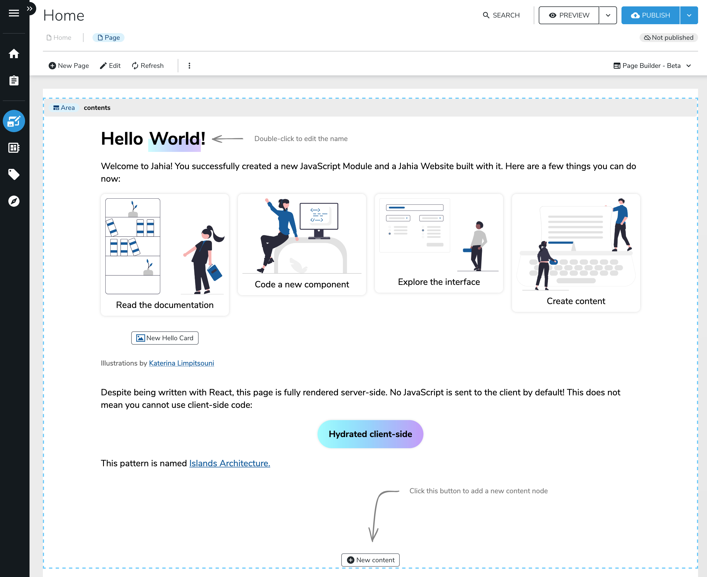

---
page:
  $path: /sites/academy/home/get-started/front-end-developer/introduction
  jcr:title: Introduction
  j:templateName: documentation
content:
  $subpath: document-area/content
---

Welcome to the JavaScript Modules documentation!

Here is what you would get within minutes. The code is written in React/JSX and made interactive on the client; Jahia is the first Java CMS to support [partial hydration/island architecture](https://www.jahia.com/blog/leveraging-the-island-architecture-in-jahia-cms) on the market.

This documentation is meant for self-learning, but we also offer workshops and training sessions with our team. If you are interested in that, please [contact us.](https://www.jahia.com/contact)

If you're still reading this and want to get started—for real—[let's dive in!](/cms/{mode}/{lang}/sites/academy/home/get-started/front-end-developer/setting-up-your-dev-environment.html)
