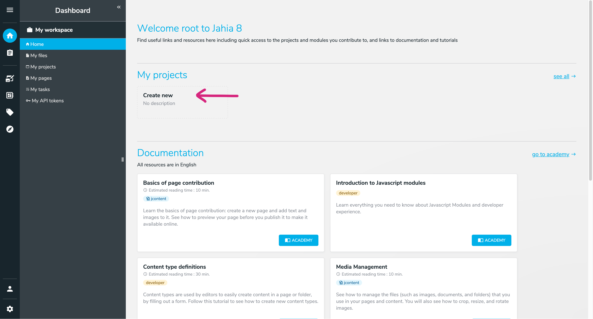

# Setting Up Your Dev Environment

This tutorial will guide you through the setup of your development environment to start a local Jahia instance and create a new project. We assume you have some familiarity with JavaScript and React, if that's not the case, we recommend you to follow a few tutorials to learn the basics:

- JavaScript: [javascript.info](https://javascript.info/)
- React: [react.dev/learn](https://react.dev/learn)

## Pre-Requisites

We'll be running Jahia in a Docker container and using Node.js to build our project. Make sure you have the following tools installed:

- Docker: [docs.docker.com/get-docker](https://docs.docker.com/get-docker/).
- Node.js 22+: [nodejs.org/en/download](https://nodejs.org/en/download). Select **for [your platform]** and **with Yarn** instead of with npm. Keep the default installation method for your platform.
- A code editor: we recommend [Visual Studio Code](https://code.visualstudio.com/).

At this time of writing here are the versions we are using:

```bash
$ node -v
v22.14.0
$ docker -v
Docker version 27.5.1, build 9f9e405
```

It might work with other versions but we can't guarantee it. If you encounter any issues, please refer to the official documentation of the tools.

> [!IMPORTANT]
> Make sure you are running **Node 22.14 or later** by running `node -v`. You will need **Yarn 4.9** or later, which **should be managed by [Corepack](https://github.com/nodejs/corepack)**. Make sure to run `corepack enable yarn` to enable it. [You don't need a global installation of Yarn.](https://yarnpkg.com/getting-started/install)

## Create a New Project

We'll create a new project using Jahia's [@jahia/create-module](https://www.npmjs.com/@jahia/create-module) CLI. In this tutorial, we'll create a new project named `hydrogen` for a fictional company named Hydrogen, but you are free to choose your own name.

```bash
# Create a new project in ./hydrogen
npm init @jahia/module@latest hydrogen
```

Once your project is ready, the tool will suggest you to run a few commands to start it. **Make sure Docker Desktop is running** and run them all in order to start your new project.

Please note that git commands, while optional, are strongly recommended. If `code .` doesn't work, open your code editor and open the project folder manually.

## Project Structure

The project you created has the following structure:

- `.github/`: GitHub Actions configuration, builds your module on push.
- `.idea/`: JetBrains IDE configuration.
- `.vscode/`: VSCode configuration. **Make sure to install the recommended extensions!** Search `@recommended` in the extensions tab to list them.
- `.yarn/`, `.yarnrc.yml` and `yarn.lock`: Yarn configuration and lock file.
- `node_modules/`: Node.js dependencies.
- <mark>`settings/`: Jahia-specific settings.</mark>
  - `content-types-icons/`: Icons for content types.
  - `locales/`: Translations for your code.
  - `resources/`: Translations used in Jahia interface.
  - `definitions.cnd`: Root Compact Node Definition file.
  - `import.xml`: Defines pages and contents to create when creating a new site.
  - `template-thumbnail.png`: Thumbnail for your module.
- <mark>`src/`: Your code!</mark>
- `static/`: Static files like images, fonts, etc.
- `.env`: Environment variables used by build tools.
- `.node-version`: Node.js version to use, used by many tools including GitHub Actions.
- `.prettierginore` and `prettier.config.js`: [Prettier (code formater)](https://prettier.io/) configuration.
- `eslint.config.js`: [ESLint (code linter)](https://eslint.org/) configuration.
- `package.json`: Project manifest.
- `tsconfig.json`: [TypeScript (typed JavaScript)](https://www.typescriptlang.org/) configuration.
- `vite.config.mjs`: [Vite (JavaScript bundler)](https://vite.dev/) configuration.

We highlighted the most important folders and files, and we'll describe the content of the `src/` folder in the next sections.

You project is fully configured to work out the box with VSCode and IntelliJ. If you're not familiar with all these tools, take a few minutes to read about them. They will make your life easier.

## Creating a New Site

Now that your _template set_ (that's how we call a module that provides page templates) was pushed by the `yarn dev` command, you can create a new website with it:

1. Open [localhost:8080](http://localhost:8080) and login with `root`: `root1234`.

2. Click My projects > **Create New** > **Create**.

   

3. Fill the form:

   

4. Select the template set you created in the previous step.

   

5. Click **Next** and **Save**.

6. Open **Page Builder** and _voilà_! ✨

   

Congratulations! You have successfully set up your development environment and created a new project in Jahia. In the next sections, we'll start building the project.

Next: [Making a Hero Section](../2-making-a-hero-section/)
