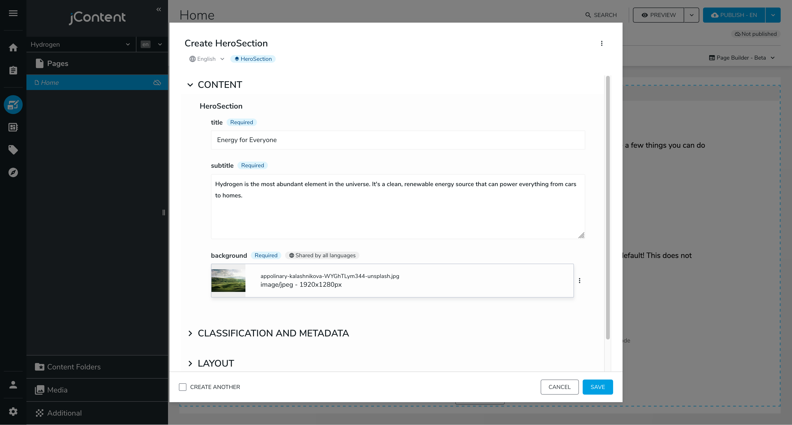

---
page:
  $path: /sites/academy/home/get-started/front-end-developer/making-a-hero-section
  jcr:title: Making a Hero Section
  j:templateName: documentation
content:
  $subpath: document-area/content
---

In this section, we'll create a hero section for our website. A hero section is a large, full-width section at the top of a page. It usually contains a title, a subtitle, and a background image.

## Working With Editable Content

At its core, Jahia is a content management system (CMS). This means that content is king: **all development work starts with content modeling**. Jahia is built on top of [Apache Jackrabbit](https://jackrabbit.apache.org/jcr/index.html), a tree-based Java Content Repository (JCR, for short). **This means that content is stored in a tree structure**, and each node can have properties and child nodes. Nodes are defined by node types, which are similar to tables in a relational database. **Node definitions are stored in CND files**, which stands for "Compact Node Definition".

JavaScript modules are designed using the Single Directory Components (SDC) pattern. This means that each component is a folder containing all the resources needed to render it. The `src/components/` folder already contains some example components used to display a Hello World message. We'll create a new `HeroSection` component following the same pattern.

Start by creating folders in `src/components/` called `Hero/Section/`. Inside this folder, create a `definition.cnd` file with the following content:

```cnd
[hydrogen:heroSection] > jnt:content, hydrogenmix:component
 - title (string) i18n mandatory
 - subtitle (string, textarea) i18n mandatory
 - background (weakreference, picker[type='image']) mandatory < jmix:image
```

That's a lot of new concepts! Let's break this node definition down:

`[hydrogen:heroSection]` is the node type name. It's prefixed with `hydrogen`, a namespace, to avoid conflicts with other node types. If you're not using the name `hydrogen` for your module, check `settings/definitions.cnd` for the namespace you should use.

`> jnt:content, hydrogenmix:component` means that `heroSection` extends `jnt:content` and `hydrogenmix:component`. `jnt:content` is the root node type of all user-created content, while `hydrogenmix:component` is a mixin, a reusable node fragment that can be added to other node types but cannot be instantiated on its own. You can find the definition for `hydrogenmix:component` in `settings/definitions.cnd`.

The following three lines define the properties of the `heroSection` node type. Each line follows the same pattern:

- `title`, `subtitle` and `background` are the property names.

- `string` and `weakreference` are the property types. The `string` type is a simple text field, while `weakreference` is a reference to another node in the repository.

- Next to the property type, we can specify hints for the edition interface: these details are ignored by the storage layer but help make the editing experience more user-friendly. `textarea` is a hint for the editor to display a larger text input, and `picker[type='image']` is a hint for the editor to display an image picker.

- `i18n` and `mandatory` are attributes: they change the behavior of the property. `i18n` means that the property is translatable, and `mandatory` means that the property is required.

- `< jmix:image` is a constraint: it means that the `background` property can only reference nodes of type `jmix:image`. `jmix:image` is a built-in mixin that represents an image.

If you have a specific hero section design in mind, you can add more properties to the node definition. Don't add Call to Action (CTA) buttons or links yet, we'll cover that in a later step. You can find all the available property types and constraints in the [CND Reference](../../3-reference/1-cnd-format/).

You can stop and restart `yarn dev` to push this definition to your Jahia instance. The file watcher only detects updates to existing files, not new files. If all goes well, you should now have the `heroSection` node type available in the content editor.

Click **New content** and select **heroSection** to create a new hero section:

:::warning
Jahia will refuse your type definition if it contains a breaking change. During development, you can use the [Installed definitions browser](http://localhost:8080/modules/tools/definitionsBrowser.jsp) tool to remove your type definition and push a new one.
:::


Jahia created an edition interface with our node definition. It prompts the user for the properties we defined: a title, a subtitle, and a background image. The image picker allows the user to select an image from already uploaded images or to upload a new one:



_Picture by [Appolinary Kalashnikova](https://unsplash.com/@appolinary_kalashnikova), formerly on [Unsplash](https://unsplash.com/)_

Click **Save** and see the new hero section in the content tree:

> No rendering set for node: herosection<br>
> Types: [hydrogen:heroSection]

This error message means that Jahia doesn't know how to render the `heroSection` node type: we haven't implemented the rendering logic yet. We'll do that next.

## Rendering Content

We must tell Jahia how to render our `heroSection` node type using the `jahiaComponent` function from the `@jahia/javascript-modules-library` package. In the `Hero/Section` folder, create a `default.server.tsx` file with the following content:

```tsx
import { buildNodeUrl, jahiaComponent } from "@jahia/javascript-modules-library";
import type { JCRNodeWrapper } from "org.jahia.services.content";

/** Properties defined in ./definition.cnd */
interface Props {
  title: string;
  subtitle: string;
  background: JCRNodeWrapper;
}

// Declare how to render the component
jahiaComponent(
  {
    componentType: "view",
    nodeType: "hydrogen:heroSection",
    displayName: "Hero Section",
  },
  ({ title, subtitle, background }: Props) => (
    <header style={{ backgroundImage: `url(${buildNodeUrl(background)})` }}>
      <h1>{title}</h1>
      <p>{subtitle}</p>
    </header>
  ),
);
```

This code tells Jahia how to render the `heroSection` node type as a React component. Once pushed to your Jahia instance (you may need to rerun `yarn dev` for the bundler to pick up the new file), the error message should disappear, and the hero section should render correctly, albeit without any styling.

The file is named `default.server.tsx` because it's the `default` view for the Hero Section `server` component. We'll create non-default views later.

`buildNodeUrl` is a helper to transform a node into a URL to its content. We'll need this every time we want to reference a resource in the browser: for ``, `<a />`, `background-image`, etc.

We named this file `default.server.tsx` because it's the default view for this node type; the same node type can have multiple views, each with its own rendering logic.

You can move this section above the Hello World section and click **Preview** to see the hero section in action:


Let's make this hero section look better by adding some CSS. We recommend [CSS Modules](https://css-tricks.com/css-modules-part-1-need/) to build modular and maintainable styles. Create a `component.module.css` file in the `Hero/Section` folder with the following content:

```css
.hero {
  display: flex;
  flex-direction: column;
  justify-content: center;
  align-items: center;
  gap: 0.5rem;
  min-height: 50vh;
  color: #fff;
  background: #d3deda 50% 25% / cover;
  text-shadow: 0 0 0.25rem #0008;
  overflow: hidden;

  > * {
    margin: 0;
    text-align: center;
  }

  > h1 {
    font-size: 3rem;
    line-height: 1;
  }
}
```

Update `default.server.tsx` to reference your styles:

```tsx
import classes from "./component.module.css";

// Add `className={classes.hero}` to the header element:
<header className={classes.hero} style={{ backgroundImage: `url(${buildNodeUrl(background)})` }}>
  {/* ... */}
</header>;
```

Once saved and pushed to your Jahia instance, the hero section should look _much_ better:


## Call to Action

Now that we have a hero section, let's add call to action (CTA) buttons to it. Create a new `Hero/CallToAction` directory (in `src/compontents`) containing a `definition.cnd` file with the following content:

```cnd
[hydrogen:heroCallToAction] > jnt:content, hydrogenmix:component
 - title (string) i18n mandatory
 - j:linkType (string, choicelist[linkTypeInitializer]) mandatory
```

While `title` is a common property, `j:linkType` is a property that has a special behavior. It's implemented within Jahia to provide a link picker interface. It offers three link types: internal, external and none. External links are URLs, internal links are references to other nodes in the repository, and none means that the button is disabled.

Add the following line to the `Hero/Section/definition.cnd` file:

```cnd
 + * (hydrogen:heroCallToAction)
```

Lines starting with a `+` define child nodes. As we said previously, nodes are stored in a tree structure, and each node can have child nodes. This line tells Jahia that a `heroSection` node can have many `heroCallToAction` child nodes.

Create the following files to render the `heroCallToAction` node type:

<details>
<summary><code>src/components/Hero/CallToAction/default.server.tsx</code></summary>

```tsx
import { buildNodeUrl, jahiaComponent } from "@jahia/javascript-modules-library";
import type { JCRNodeWrapper } from "org.jahia.services.content";
import classes from "./component.module.css";

type Props = {
  title: string;
} & ( // Reflect the three possible values of j:linkType
  | { "j:linkType": "none" }
  | { "j:linkType": "external"; "j:url": string; "j:linkTitle": string }
  | { "j:linkType": "internal"; "j:linknode": JCRNodeWrapper }
);

jahiaComponent(
  {
    componentType: "view",
    nodeType: "hydrogen:heroCallToAction",
    displayName: "Call To Action",
  },
  (props: Props) => {
    switch (props["j:linkType"]) {
      case "external":
        return (
          <a href={props["j:url"]} title={props["j:linkTitle"]} className={classes.cta}>
            {props.title}
          </a>
        );

      case "internal":
        return (
          <a href={buildNodeUrl(props["j:linknode"])} className={classes.cta}>
            {props.title}
          </a>
        );

      case "none":
        return <s>{props.title}</s>;
    }
  },
);
```

</details>

<details>
<summary><code>src/components/Hero/CallToAction/component.module.css</code></summary>

```css
.cta {
  display: block;
  padding: 1rem;
  border: 2px solid #fff;
  color: #fff;
  font-weight: bold;
  backdrop-filter: blur(0.5rem);
  transition:
    transform 150ms,
    background 150ms;
  text-decoration: inherit;

  &:hover,
  &:focus {
    transform: scale(1.05);
    background-color: #fff8;
  }
}
```

</details>

We now have a working CTA button component, but we still need to add it to our hero section. Update `Hero/Section/default.server.tsx` to render the `heroCallToAction` nodes:

```tsx
<header className={classes.hero} style={{ backgroundImage: `url(${buildNodeUrl(background)})` }}>
  <h1>{title}</h1>
  <p>{subtitle}</p>
  <div style={{ display: "flex", gap: "1rem" }}>
    <RenderChildren />
  </div>
</header>
```

You'll need to import `RenderChildren` from `@jahia/javascript-modules-library` for it to work.

Once pushed to your Jahia instance, if you create a CTA button in your hero section, it should render correctly:


You can add as many CTAs as you want to your hero section. This is why we haven't defined our CTA properties on `heroSection` directly: it allows for more flexibility and reusability.

:::info
You can, at all times, take a look at your data tree with the [JCR repository browser](http://localhost:8080/modules/tools/jcrBrowser.jsp).
For instance, you should be able to find the content you created at the `sites/<site key>/home/main` path.
It can be useful to remove buggy nodes or to understand how your data is persisted.
:::

Next: [The "About Us" Page](the-about-us-page)
