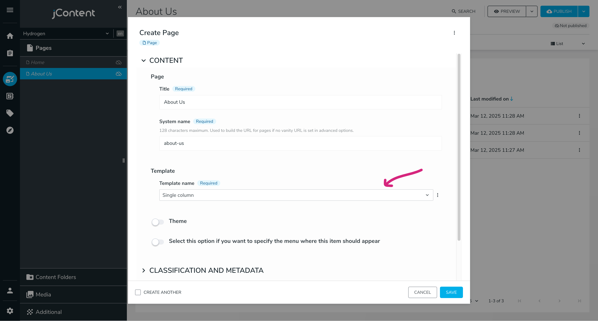
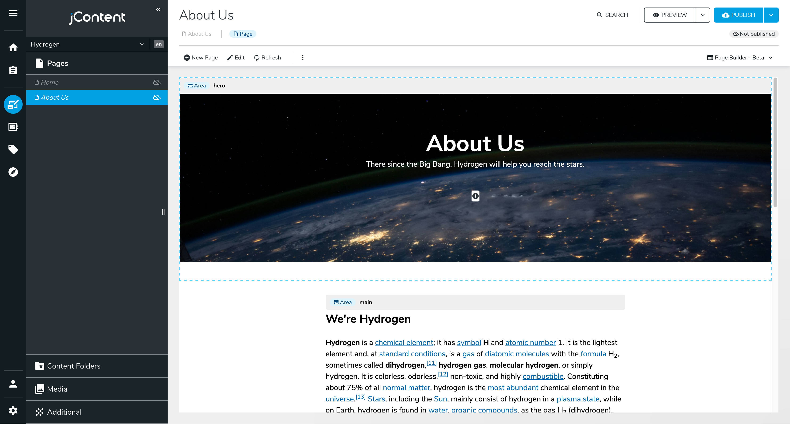
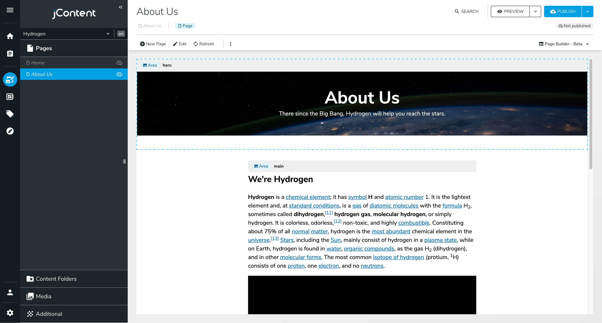
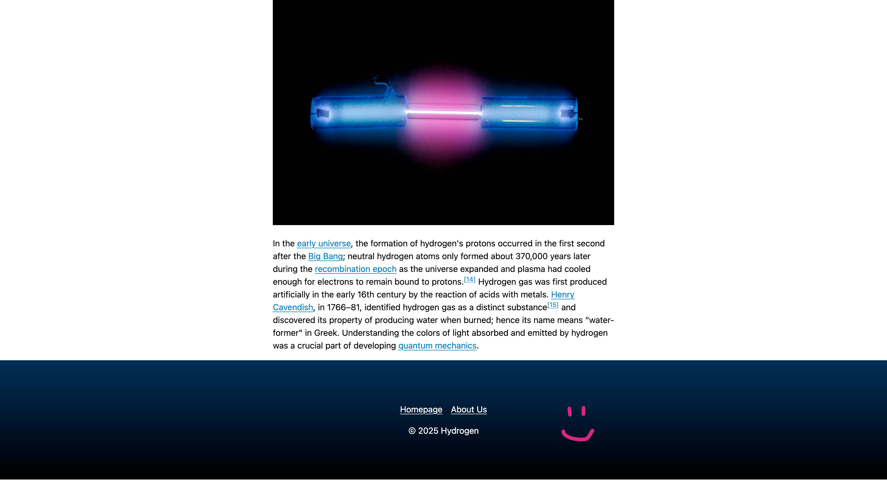

# The "About Us" Page

Our homepage is based on a "basic" layout: take a look at `src/pages/basic.server.tsx`. It's a single column layout defined by an `<Area>` without any constraints. If a user wants to place many Hero sections on the page, they can do it. Most websites have a slightly more controlled layout: a navbar, a title, a footer, optional sidebars, etc. In this section, we'll create a page layout that suits a typical "About Us" page.

## Page Templates

Pages are content nodes, like the `heroSection` and `heroCallToAction` nodes we created previously. Their type is `jnt:page`, and as for all content, you can tell Jahia how to render them.

We'll create a single-column layout with a hero section on top. Create a file named `singleColumn.server.tsx` in `src/pages`:

```tsx
import { Area, jahiaComponent } from "@jahia/javascript-modules-library";
import { Layout } from "./Layout.jsx";

jahiaComponent(
  {
    componentType: "template",
    nodeType: "jnt:page",
    displayName: "Single column page template",
    name: "singleColumn",
  },
  ({ "jcr:title": title }) => (
    <Layout title={title}>
      <Area name="header" nodeType="hydrogen:header" />
      <main style={{ maxWidth: "40rem", margin: "0 auto" }}>
        <Area name="main" />
      </main>
    </Layout>
  ),
);
```

Instead of using `jahiaComponent` to define a view, we use `componentType: "template"`. A template is like a view but for a full-page resource.

Let's break this code down:

- The `Layout` component is a simple wrapper that adds `<head>` and `<body>` tags to the page.

- We define two `<Area>`s: `header` and `main`. An area is an entry point for users to add content. By default, an area is of node type `jnt:contentList`, but since we want to make our header area more specific, we set `nodeType="hydrogen:header"`.

We need to define this new header node. We will make it simple to start with, our header will only contain a hero section.

<details>
<summary><code>src/components/Header/definition.cnd</code></summary>

```cnd
[hydrogen:header] > jnt:content
 + hero (hydrogen:heroSection)
```

We don't extend `hydrogenmix:component` because we don't want to make this component available to users. It's a technical node that will contain a single `heroSection`.

</details>
<details>
<summary><code>src/components/Header/default.server.tsx</code></summary>

```tsx
import { jahiaComponent, RenderChild } from "@jahia/javascript-modules-library";

jahiaComponent(
  {
    componentType: "view",
    nodeType: "hydrogen:header",
  },
  () => <RenderChild name="hero" />,
);
```

</details>

Go ahead and create a new page on your site. Right click the left panel, under Home, select **+ New Page** and chose the **Single column** template. Give your page a title and save it. If you don't see the **Single column** template, you may need to restart `yarn dev` for the new template to be picked up.



You should now see an empty page with two insertion points: one named `hero` and the other named `main`.

Create some content for your About Us page:



_[Picture by Nasa](https://unsplash.com/photos/photo-of-outer-space-Q1p7bh3SHj8), [text from Wikipedia](https://en.wikipedia.org/w/index.php?title=Hydrogen&oldid=1279844492)_

Isn't it a bit weird to have CTA buttons on an "About Us" page? Fortunately, Jahia supports multiple views for the same node type.

## Same Node, Different Views

In `Header/default.server.tsx`, replace the current `<RenderChild name="hero" />` with:

```tsx
<RenderChild name="hero" view="small" />
```

This additional property, `view`, defines the view that should be used when Jahia renders the `heroSection` component. We haven't created the `small` view yet, if you refresh your page right now you will see an error message instead:

> No rendering set for node: herosection<br/>
> Types: [hydrogen:heroSection]

Start by adding a file named `src/components/Hero/Section/types.ts` and move `Props` to it:

```tsx
import type { JCRNodeWrapper } from "org.jahia.services.content";

/** Properties defined in ./definition.cnd */
export interface Props {
  title: string;
  subtitle: string;
  background: JCRNodeWrapper;
}
```

This way, we can import `Props` in multiple files without duplicating the type definition. Create a new file named `src/components/Hero/Section/small.server.tsx`:

```tsx
import { buildNodeUrl, jahiaComponent } from "@jahia/javascript-modules-library";
import classes from "./component.module.css";
import type { Props } from "./types.js";

jahiaComponent(
  {
    componentType: "view",
    nodeType: "hydrogen:heroSection",
    displayName: "Small Hero Section",
    name: "small",
  },
  ({ title, subtitle, background }: Props) => (
    <header
      className={[classes.hero, classes.small].join(" ")}
      style={{ backgroundImage: `url(${buildNodeUrl(background)})` }}
    >
      <h1>{title}</h1>
      <p>{subtitle}</p>
    </header>
  ),
);
```

Finally, update `component.module.css` to include a new class:

```css
.small {
  min-height: 25vh;
}
```

You can also update `default.server.tsx` to include `Props` instead of defining it again.

The difference between `small.server.tsx` and `default.server.tsx` is the fact that we declare the component with `name: "small"`. This registers a second view named small for the `heroSection` node type. When `name` is not provided, the view is considered the default one.

After pushing these changes to your Jahia instance, you should see a smaller hero section on your "About Us" page, without the possibility to add CTA buttons:



## A Common Footer

Our page lacks a footer. Let's create a footer component and add it to the `singleColumn` template. It'll be a simple component with a copyright notice and a list of links, but you can make it as complex as you want.

<details>
<summary><code>src/components/Footer/definition.cnd</code></summary>

```cnd
[hydrogen:footer] > jnt:content, hydrogen:component orderable
 - notice (string) = '' i18n autocreated
 + * (jmix:link)
```

We use `autocreated` with an empty string as the default value so that Jahia can create the node without user input. We also use `orderable` to allow users to reorder the links.

</details>

<details>
<summary><code>src/components/Footer/default.server.tsx</code></summary>

```tsx
import { jahiaComponent, RenderChildren } from "@jahia/javascript-modules-library";
import classes from "./component.module.css";

interface Props {
  notice: string;
}

jahiaComponent(
  {
    componentType: "view",
    nodeType: "hydrogen:footer",
    displayName: "Default Footer",
  },
  ({ notice }: Props, { renderContext, currentNode }) => {
    return (
      <footer className={classes.footer}>
        {/* In edition mode, links are piled up to make edition easier */}
        <nav style={{ flexDirection: renderContext.isEditMode() ? "column" : "row" }}>
          <RenderChildren />
        </nav>
        <p>
          © {new Date().getFullYear()} {notice}
        </p>
      </footer>
    );
  },
);
```

</details>

<details>
<summary><code>src/components/Footer/component.module.css</code></summary>

```css
.footer {
  padding: 4rem 1rem;
  color: #fff;
  background: linear-gradient(to bottom, #024, #000);

  > nav {
    display: flex;
    justify-content: center;
    gap: 1rem;
    margin-block: 1rem;
  }

  > p {
    text-align: center;
  }

  a {
    color: inherit;
  }
}
```

</details>

To add this footer to our layout, but make sure it's always the same footer in all pages, we'll use `<AbsoluteArea>` instead of `<Area>`. Update `singleColumn.server.tsx`:

```tsx
<Layout title={title}>
  {/* ... */}
  <AbsoluteArea name="footer" parent={renderContext.getSite()} nodeType="hydrogen:footer" />
</Layout>
```

`<AbsoluteArea>` is a special area that will synchronize its content across all pages. It's useful for elements that should be the same everywhere, like a footer or a navbar. To do so, we have to reference the same node for all pages. To make it easier, we set the parent to the site node. Make sure to retreive `renderContext` from the second argument of the render function.

Try adding a few links to the footer that should be created at the end of the `singleColumn` template. You can also update the copyright notice with your company name. Once done, you should see a footer at the bottom of your page:



If you create another page with **Single column**, you should be able to create a new Hero section, but the footer will be the same as the one on the "About Us" page.

Next: [Making a Blog](../4-making-a-blog/)
