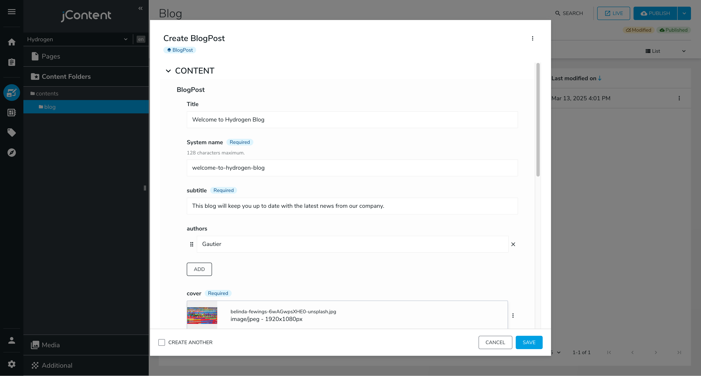
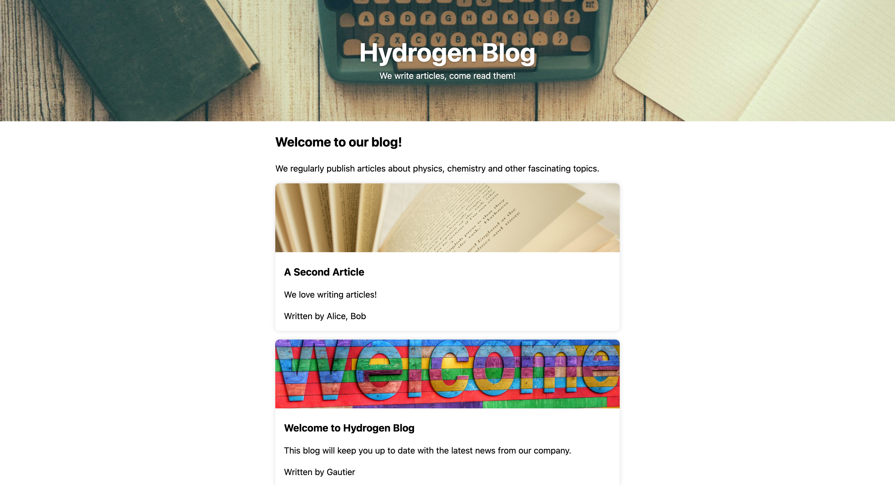

# Making a Blog

So far we only considered contributing pages visually, directly in Page Builder. This is great for individual, unique pages but it's not the best way to manage a blog. In a blog, you want all your articles to have the same structure and style, and you want to be able to manage them all in one place.

## Blog Post Type

Let's start by creating a node type called `blogPost`. We'll keep it concise but feel free to add more fields if you need them. Create a new file named `src/components/BlogPost/definition.cnd`:

```cnd
[hydrogen:blogPost] > jnt:content, mix:title, jmix:mainResource, hydrogenmix:component
 - subtitle (string) i18n mandatory
 - authors (string) multiple
 - cover (weakreference, picker[type='image']) mandatory < jmix:image
 - body (string, richtext) i18n mandatory
```

You might notice the `multiple` keyword next to authors: its allows setting a list of strings instead of a single one. Because it is not marked as mandatory, it may be undefined: we will treat this case as an empty list. `mix:title` is a mixin that adds a `jcr:title` field to the node type.

Create a `types.ts` file in the same folder:

```ts
import type { JCRNodeWrapper } from "org.jahia.services.content";

export type Props = {
  "jcr:title": string;
  "subtitle": string;
  "authors"?: string[];
  "cover": JCRNodeWrapper;
  "body": string;
};
```

Let's also create a simple view to render the blog post as a card:

<details>
<summary><code>src/components/BlogPost/default.server.tsx</code></summary>

```tsx
import { buildNodeUrl, jahiaComponent } from "@jahia/javascript-modules-library";
import type { Props } from "./types.js";
import classes from "./component.module.css";

jahiaComponent(
  {
    componentType: "view",
    nodeType: "hydrogen:blogPost",
    displayName: "Blog Post",
  },
  ({ "jcr:title": title, subtitle, authors, cover }: Props, { currentNode }) => {
    return (
      <article className={classes.card}>
        
        <h3>
          <a href={buildNodeUrl(currentNode)}>{title}</a>
        </h3>
        <p>{subtitle}</p>
        {authors && authors.length > 0 && <p>Written by {authors.join(", ")}</p>}
      </article>
    );
  },
);
```

</details>
<details>
<summary><code>src/components/BlogPost/component.module.css</code></summary>

```css
.card {
  margin-block: 1rem;
  box-shadow: 0 0 0.5rem 0 #0002;
  border-radius: 0.5rem;
  contain: paint;
  transition:
    transform 150ms,
    box-shadow 150ms;

  &:hover,
  &:focus-within {
    box-shadow: 0 0 1rem 0 #0004;
    transform: scale(1.02);
  }

  > img {
    width: 100%;
    max-height: 8rem;
    object-fit: cover;
  }

  > h3,
  > p {
    margin: 1rem;
  }

  a {
    text-decoration: inherit;
    color: inherit;

    &::before {
      content: "";
      position: absolute;
      inset: 0;
    }
  }
}
```

</details>

## Content Folders

Instead of creating blog posts directly in Page Builder, we'll store our posts in **Content Folders**. This way, we can manage them all in one place and easily list them.

Create a new folder named `blog` in the `contents` folder:


Create a few blog posts in this folder:



## Listing Articles

Let's get back to the **Pages** tab of the sidebar (above Content Folders). Create a new page named "Blog" with a **Single column** layout. Create a Hero section on top of the page to introduce the list of articles.

In the main area, add a new **Jahia - Queries > Content items using JCR Query** component. The JCR is the tree-like database where all your content is stored, pages and content folders alike. We will use a JCR query to list all the blog posts. In the query field, enter:

```sql
SELECT *
FROM [hydrogen:blogPost] AS post
WHERE ISDESCENDANTNODE(post, '/sites/hydrogen/contents/blog')
```

JCR-SQL2 is a SQL-like language to query the JCR. This query selects all nodes of type `hydrogen:blogPost` that are descendants of the `/sites/hydrogen/contents/blog` node. In this query, `hydrogen` is the site key, you might have set it to something else when creating your site.


You can set _Items to show_ to a positive number to limit the number of articles displayed, or -1 to show all of them.

You can also add a rich text above and below the list of articles to introduce and conclude the blog page, and update the footer to reference your Blog page. When done, you should have a page that looks like this:



_[Cover image by RetroSupply on Unsplash](https://unsplash.com/photos/vintage-teal-typewriter-beside-book-jLwVAUtLOAQ), article images by [Belinda Fewings on Unsplash](https://unsplash.com/photos/3d-painting-of-welcome-6wAGwpsXHE0) and [Olga Tutunaru on Unsplash](https://unsplash.com/photos/white-book-page-on-white-textile-plbb7pkEjkQ)_

If you click on a blog post, you'll end up on a 404 error page. We'll take care of that in the next section. But for now...

## Publication Date

Our JCR query is pretty simple: it lists all blog posts. However, our posts are not ordered and we don't have a way to publish them at a specific date. Let's add a `publicationDate` field to our `BlogPost` type:

```cnd
 - publicationDate (date)
```

It's not marked as `mandatory` because we can't add a mandatory field to an existing type, it would be a breaking change. We will consider it a feature: if the date is not set, the post is a draft.

You also need to update the `types.ts` file:

```ts
import type { JCRNodeWrapper } from "org.jahia.services.content";

export type Props = {
  "jcr:title": string;
  "subtitle": string;
  "authors"?: string[];
  "cover": JCRNodeWrapper;
  "body": string;
  "publicationDate": string;
};
```

`publicationDate` is a string because it's a date in the ISO 8601 format. As the native `Date` object does not properly handle time zones, it's easier to handle dates as strings if your application requires time zone support.

We can also update our JCR query to order the posts by publication date, and only show published posts:

```sql
SELECT *
FROM [hydrogen:blogPost] AS post
WHERE ISDESCENDANTNODE(post, '/sites/hydrogen/contents/blog')
  AND post.[publicationDate] IS NOT NULL
ORDER BY post.[publicationDate] DESC
```

As you can see, this query looks like a regular SQL query. The `DESC` keyword orders the posts by publication date in descending order, so the most recent posts are displayed first. Don't forget to update your posts with a publication date!

Finally, it would be nice to display the publication date on the blog post card. Update the `src/components/BlogPost/default.server.tsx` file:

```tsx
// Add `currentResource` to the second argument of the function
<p>
  Written {authors && authors.length > 0 && <>by {authors.join(", ")} </>}
  {publicationDate && (
    <>
      on{" "}
      {new Date(publicationDate).toLocaleDateString(currentResource.getLocale().toString(), {
        dateStyle: "long",
      })}
    </>
  )}
</p>
```

We used `currentResource.getLocale().toString()` to get the locale of the current resource. This is useful when you want to format dates or numbers according to the current locale. We forward this locale to [`Date.toLocaleDateString`](https://developer.mozilla.org/en-US/docs/Web/JavaScript/Reference/Global_Objects/Date/toLocaleDateString) to format the publication date in a human-readable way.

There are a lot of things to discover about JCR queries, as it allows you to query, filter, order and paginate contents in a tree-like structure. You can find more information in the [Jahia documentation](https://academy.jahia.com/documentation/jahia-cms/jahia-8.2/developer/leveraging-jahia-backend-capabilities/jcrsql2-query-cheat-sheet).

Next: [View Content in Full Page](../5-view-content-in-full-page/)
