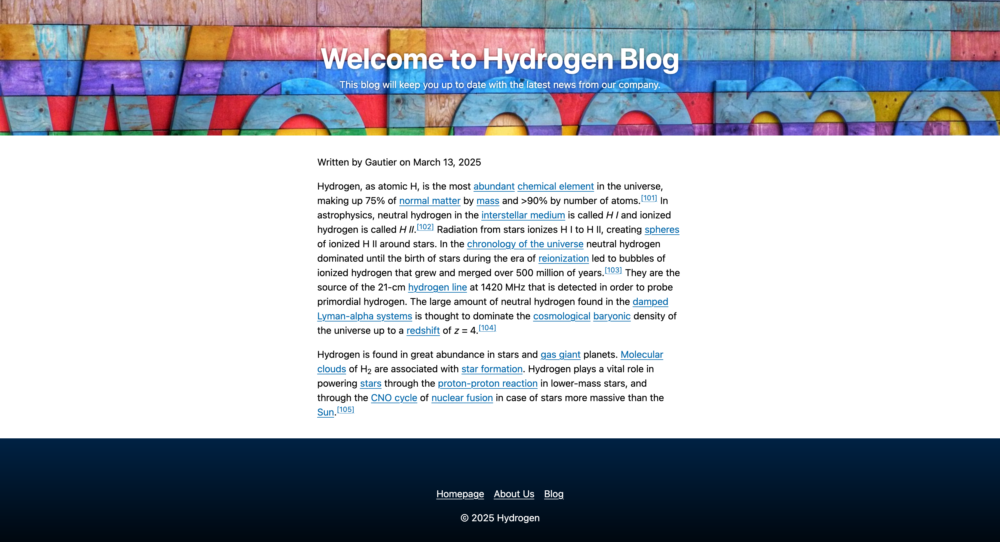

# View Content in Full Page

The goal of this section is to render a full-page view of a content node. We'll continue with our blog example, and instead of a 404 page, we'll create a page to display a single blog post.

## Full Page Views

Full page renders leverage another `jahiaComponent` type: `template`. A template is like a view but for a full-page resource.

Templates are a rather legacy feature in Jahia, dating back to the days when Jahia had a visual template builder. This distinction between view and templates makes less sense in a code editor, but it's still there. As a rule of thumb, we'll use views to render nodes and templates to create page structures.

The project template contains a file named `src/templates/MainResource/default.server.tsx` that will forward all full-page requests to a view of the same node named `fullPage`:

```tsx
import { jahiaComponent, Render } from "@jahia/javascript-modules-library";
import { Layout } from "../Layout.jsx";

jahiaComponent(
  {
    componentType: "template",
    nodeType: "jmix:mainResource",
  },
  ({ "jcr:title": title }, { currentNode }) => (
    <Layout title={title}>
      <Render node={currentNode} view="fullPage" />
    </Layout>
  ),
);
```

Thus, we will implement a `fullPage` view for our `BlogPost` node type. Create a new file named `src/components/BlogPost/fullPage.server.tsx`:

```tsx
import { AbsoluteArea, jahiaComponent } from "@jahia/javascript-modules-library";
import type { Props } from "./types.js";
import classes from "./component.module.css";
import { SmallHeroSection } from "../Hero/Section/small.server.jsx";

jahiaComponent(
  {
    componentType: "view",
    nodeType: "hydrogen:BlogPost",
    displayName: "Blog Post",
    name: "fullPage",
  },
  (
    { "jcr:title": title, subtitle, authors, publicationDate, cover, body }: Props,
    { currentResource, renderContext },
  ) => (
    <>
      <SmallHeroSection title={title} subtitle={subtitle} background={cover} />
      <main className={classes.main}>
        <header>
          <p>
            Written {authors.length > 0 && <>by {authors.join(", ")} </>}
            {publicationDate && (
              <>
                on{" "}
                {new Date(publicationDate).toLocaleDateString(
                  currentResource.getLocale().toString(),
                  { dateStyle: "long" },
                )}
              </>
            )}
          </p>
        </header>
        <article dangerouslySetInnerHTML={{ __html: body }} />
      </main>
      <AbsoluteArea name="footer" />
    </>
  ),
);
```

You can also update `src/components/BlogPost/component.module.css` to include a new class:

```css
.main {
  margin: 2rem auto;
  padding-inline: 1rem;
  max-width: 40rem;
}
```

This code contains of lot of things. Here are the most notable parts:

- We reuse `SmallHeroSection` to render a hero section at the top of the page. To make it possible, you need to update `Hero/Section/small.server.jsx` with the following statement:

  ```tsx
  export const SmallHeroSection = jahiaComponent({
    // ...
  });
  ```

  The `jahiaComponent` function returns its second argument, the React component, to make it possible to reuse it in other components.

  We forward props to the `SmallHeroSection` component, making it a very flexible component.

- We used [`dangerouslySetInnerHTML`](https://react.dev/reference/react-dom/components/common#dangerously-setting-the-inner-html) to render the body of the blog post. Because the body is a rich text field, we can't render it as a string, as it would display HTML tags as `<p>content</p>` instead of rendering the content as HTML. This is a security risk, as it allows for XSS attacks: that's why editing content is restricted to trusted users.

- We used `<AbsoluteArea name="footer" />` in the view to render the footer. This will display the footer component at the bottom of all blog posts.



## Building URLs

Wouldn't it be nice if at the end of the article we had a way to get back to the blog list? We can achieve this by building a URL to the blog list page.

Update your `src/components/BlogPost/fullPage.server.tsx` file to include the following hook:

```tsx
import { buildNodeUrl } from "@jahia/javascript-modules-library";
```

This `buildNodeUrl` function will transform a reference to a JCR node into a fully resolved URL. The node in question is `renderContext.getSite().getNode("blog")`: it resolves to `/sites/<site key>/blog`, where `blog` is the page listing all blog posts. If you have a different structure, you can adjust the path accordingly.

From this node, we can build a URL to the blog list page:

```tsx
<article dangerouslySetInnerHTML={{ __html: body }} />
<footer>
  <p>
    <a
      // @ts-expect-error Java type aren't exposed this far
      href={buildNodeUrl(renderContext.getSite().getNode("blog"))}
    >
      Back to blog home
    </a>
  </p>
</footer>
// ...
```

Apart from a node path, the `buildNodeUrl` helper takes other option parameters:

- `extension` is the file extension to append to the URL. It defaults to `.html` when not provided.
- `language` is the language to use to build the URL. It defaults to the current language.
- `mode` can be `edit`, `preview` or `live` to create URLs for different modes. It defaults to the current mode.
- `parameters` is an object of key-value pairs to append as query parameters to the URL.

In JCR, everything is a node, i.e. an entity of a tree designated by a path. The type of a node gives it a specific behavior:

- A `jnt:content` node is a content node, like a Hero section or a blog post. It is rendered by a view.
- A `jnt:page` node is a page node, the Home page or the About Us page. It is rendered by a template.
- A `jnt:virtualsite` node is a site node, the root of a site.
- A `jnt:file` node is a file node, like an image or a PDF. You can upload files to Jahia and reference them in your content.

There is a lot more to learn about URL building and JCR exploration, and it's the topic of the next section.

Next: [Building a Navigation Bar](../6-building-a-nav-bar/)
