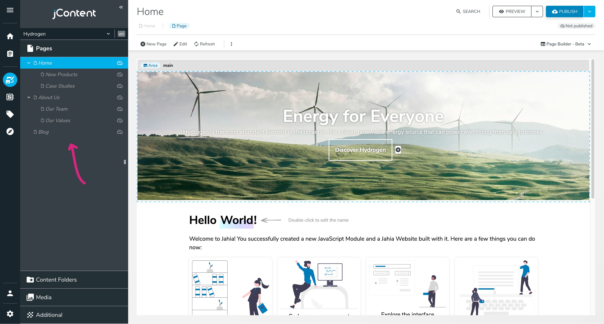
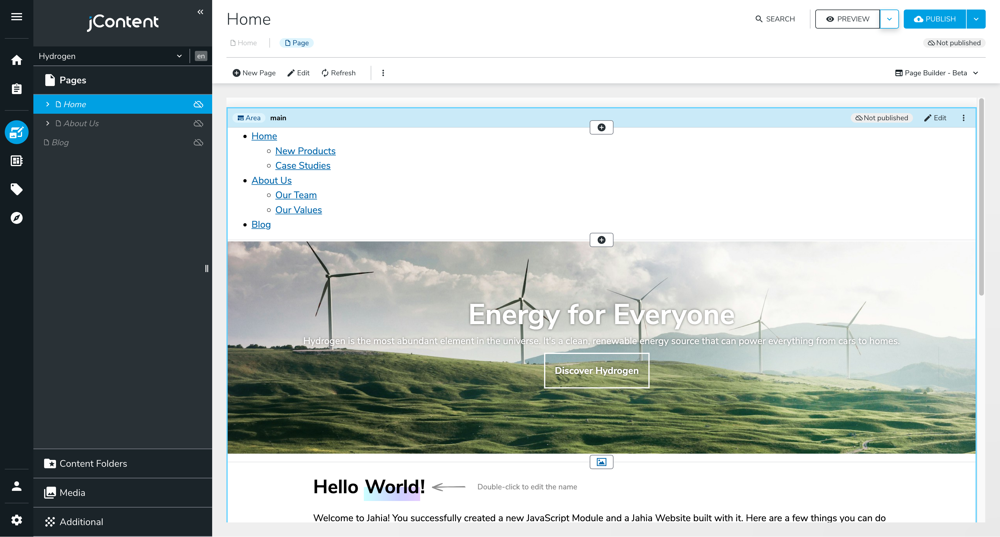
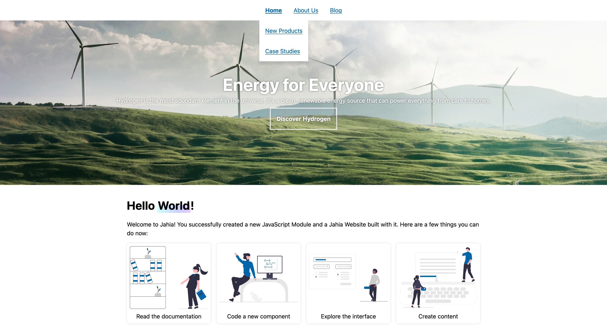
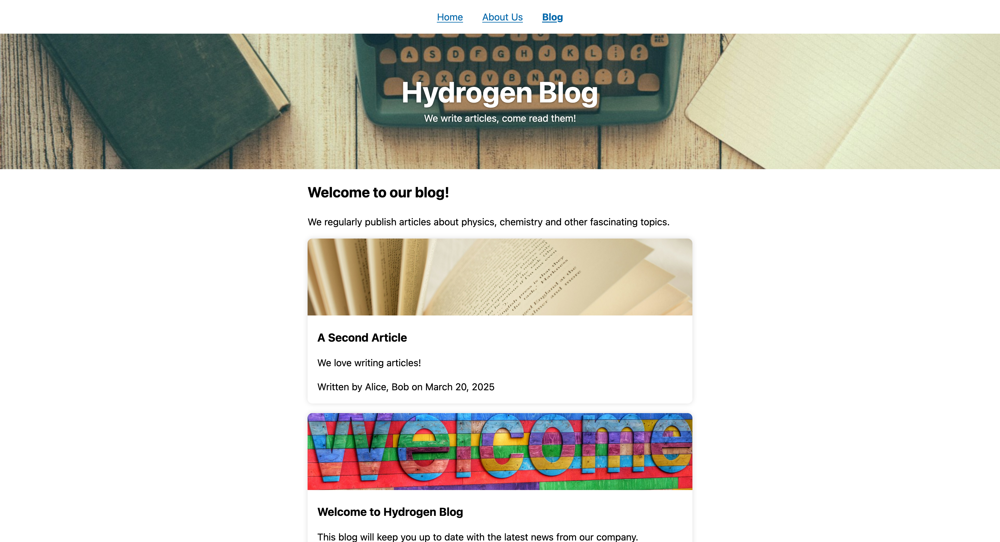

# Building a Navigation Bar

A navigation bar is a common component in web development. It allows users to navigate between different pages of a website. In this section, we will build a navigation bar for our blog site.

## Page Tree

Jahia supports creating pages in a tree structure. Each page can have child pages, forming a hierarchy. Create a few nested pages under the Home and About Us pages to create a tree structure. You can use the Page Composer sidebar to create and move pages around.



Our goal now is to build a navigation bar that displays the first two levels of the page tree. The navigation bar should be dynamic and update automatically when the page tree changes.

We'll create a new component called `navBar` with a simple definition. Create the file `src/components/NavBar/definition.cnd` with the following content:

```cnd
[hydrogen:navBar] > hydrogenmix:component, jnt:content
```

It doesn't have any properties, but you can add some if you want to customize the navigation bar further.

Our `NavBar` component will create the following HTML structure:

```html
<nav>
  <ul>
    <li>
      <a href="/home">Home</a>
      <ul>
        <li>
          <a href="/home/new-products">New Products</a>
        </li>
        <li>
          <a href="/home/case-studies">Case Studies</a>
        </li>
      </ul>
    </li>
    ...
  </ul>
</nav>
```

To get all these pages, we'll start at the site level, `renderContext.getSite()`, and iterate over all the child pages. We'll do it a second time to get the child pages of the child pages.

Iterating over children can be done with the `getChildNodes` function. It takes a node and a filtering function as arguments. The filtering function should return `true` if the node should be included in the result. We'll only keep nodes of type `jnt:page`.

Create the file `src/components/NavBar/default.server.tsx` with the following content:

```tsx
import { buildNodeUrl, getChildNodes, jahiaComponent } from "@jahia/javascript-modules-library";
import type { JCRNodeWrapper } from "org.jahia.services.content";
import type { JCRSiteNode } from "org.jahia.services.content.decorator";

/** Get all child pages of a node. */
const getChildPages = (node: JCRNodeWrapper | JCRSiteNode) =>
  getChildNodes(node, -1, 0, (node) => node.isNodeType("jnt:page"));

jahiaComponent(
  {
    componentType: "view",
    nodeType: "hydrogen:navBar",
    displayName: "NavBar",
  },
  (_, { renderContext, mainNode }) => (
    <nav>
      <ul>
        {getChildPages(renderContext.getSite()).map((page) => (
          <li key={page.getPath()}>
            <a href={buildNodeUrl(page)} aria-current={page === mainNode ? "page" : undefined}>
              {page.getProperty("jcr:title").getString()}
            </a>
            <ul>
              {getChildPages(page).map((page) => (
                <li key={page.getPath()}>
                  <a
                    href={buildNodeUrl(page)}
                    aria-current={page === mainNode ? "page" : undefined}
                  >
                    {page.getProperty("jcr:title").getString()}
                  </a>
                </li>
              ))}
            </ul>
          </li>
        ))}
      </ul>
    </nav>
  ),
);
```

We use [`aria-current="page"`](https://developer.mozilla.org/en-US/docs/Web/Accessibility/ARIA/Reference/Attributes/aria-current#page) rather than a CSS class to indicate the current page to make the navigation bar accessible.

You can push your component to Jahia and see it in action by adding it to the Home page:



Finally, we can add a pinch of CSS to style the navigation bar. Create a `component.module.css` file in the `NavBar` folder with the following content:

```css
.nav {
  ul {
    display: flex;
    list-style: none;
    justify-content: center;
    margin: 0;
    padding: 0;
  }

  li > a {
    display: inline-block;
    padding: 1rem;
  }

  li > ul {
    flex-direction: column;
    position: absolute;
    background: #fff;
    box-shadow: 0 0.5rem 0.5rem #0002;
    transform-origin: top;
    transform: scaleY(0);
    transition: transform 150ms;
    z-index: 1;
  }

  li:hover ul,
  li:focus-within ul {
    transform: scaleY(1);
  }

  [aria-current="page"] {
    font-weight: bold;
  }
}
```

You'll need to add `import classes from "./component.module.css";` and `className={classes.nav}` to the `nav` element in the `NavBar` component to apply the styles.



## Render Virtual Nodes

If you navigate to another page than the Home page, the navigation bar will not be there. We could add an `<AbsoluteArea>` to the `singleColumn.server.tsx` template to share the navigation bar across all pages. However, since our navigation bar does not take any parameters, we can save our editors some time by rendering it as a virtual node.

In `src/templates/Page/singleColumn.server.tsx`, add the following import:

```tsx
import { Render } from "@jahia/javascript-modules-library";
```

Above the `<Area name="header" nodeType="hydrogen:header" />` line, add the following code:

```tsx
<Render content={{ nodeType: "hydrogen:navBar" }} />
```

This code will render the `NavBar` component as a virtual node on every page using this template. Once pushed to Jahia, you can navigate to any page, and the navigation bar will be there:



You've made it to the end of the getting started! We hope you enjoyed this tutorial and are excited to continue building your Jahia website with React and JavaScript.

As this tutorial is brand new, we would love to hear your feedback. Please let us know what you liked, what you didn't like, and what you would like to see in the future. You can reach out to us on our [GitHub repository](https://github.com/Jahia/javascript-modules/issues/new?template=other.md).
