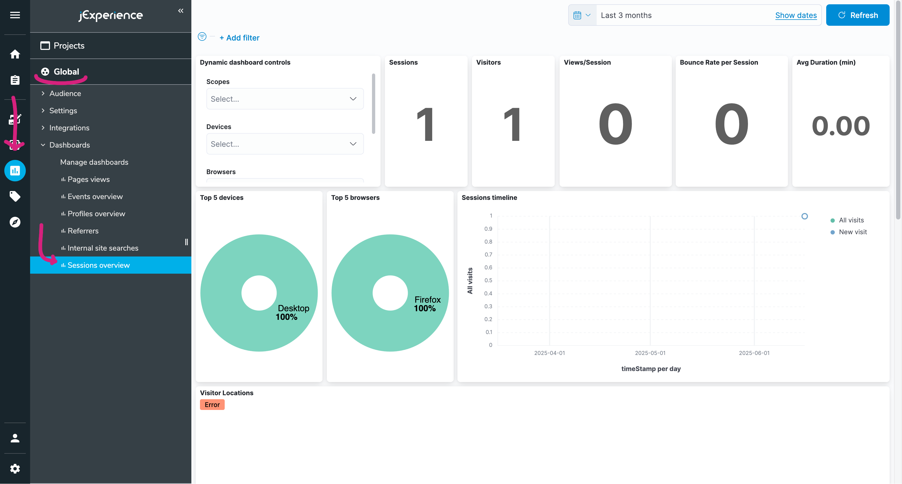

# Building a Feedback Form

The goal of this self-contained guide is to create a feedback form that uses client-side JavaScript to send data to a server. This first half will be about building the form, the second half about collecting the data on the server with jCustomer.

This guide assumes you have followed the [Getting Started](../1-getting-started/1-dev-environment/) guide and have a working Jahia instance with a JavaScript Module running on it. If you haven't done so, please follow the instructions in that guide before continuing.

## Client-Side JavaScript

The JavaScript Modules Library features a component we haven't used yet: `RenderInBrowser`. Contrary to the getting started, where all components were rendered on the server, this component allows you to render a component in the browser, and the browser only. This is useful for components that only make sense in the browser, because they need to be interactive.

Let's start by creating a very basic node type and view for our feedback form:

- Create `src/components/feedbackWidget/defintion.cnd` with the following content:

```cnd
[hydrogen:feedbackWidget] > jnt:content, hydrogenmix:component
```

- Create `src/components/feedbackWidget/default.server.ts` with the following content:

```tsx
import { jahiaComponent } from "@jahia/javascript-modules-library";

jahiaComponent(
  {
    nodeType: "hydrogen:feedbackWidget",
    componentType: "view",
  },
  () => <div>Hello World!</div>,
);
```

Start or restart `yarn dev` to push the component to your local Jahia instance. Add your component to a page and check that it renders correctly. You should see "Hello World!" in the browser.

You can try replacing the `div` with `<button onClick={() => alert("Hello World!")}>Click me</button>` to see that the component, when rendered on the server, does not become interactive. This is intended: the default rendering mode (Server-Side Rendering, SSR) ships no JavaScript to the browser.

Let's create an interactive component: create a file named `src/components/feedbackWidget/Widget.client.tsx` with the following content:

```tsx
export default function Widget() {
  return (
    <button
      onClick={() => {
        alert("Hello World!");
      }}
    >
      Click me
    </button>
  );
}
```

You might have noticed that the file uses the `.client.tsx` extension: it will be transpiled during the client build step, whereas the `.server.tsx` files are transpiled during the server build step. These extensions can be changed in the `vite.config.js` file, but we recommend keeping the default ones for consistency with the rest of the community.

Update the `src/components/feedbackWidget/default.server.tsx` file to use the new component:

```tsx
import { jahiaComponent, RenderInBrowser } from "@jahia/javascript-modules-library";
import Widget from "./Wigdet.client.jsx";

jahiaComponent(
  {
    nodeType: "feedbackWidget:widget",
    componentType: "view",
  },
  () => <RenderInBrowser child={Widget} />,
);
```

You'll need to restart `yarn dev` for Vite to collect your new client files, but once pushed, should see the exact same button as before, but now it will alert "Hello World!" when clicked.

The `RenderInBrowser` component is a wrapper that will ensure the code of `Widget` gets forwarded to the browser, enabling what is called "partial hydration": only this component will be hydrated, and the rest of the page will remain server-rendered. This is a great way to improve performance, as it allows you to only ship the JavaScript that is needed for the interactive parts of your page.

If you nest children to `RenderInBrowser`, they will be displayed until `Widget` is loaded. This is where you can put a loading message for instance: `<RenderInBrowser child={Widget}>The widget is loading...</RenderInBrowser>`.

You now have all the tools needed to build any client-side component, but keep on reading to learn how to send data to jCustomer.

We'll build the simplest feedback form possible: two buttons, one for "yes" and one for "no". Styling is left as an exercise for the reader, we'll keep the default browser styles in this guide.

Update `Widget.client.tsx` to the following content:

```tsx
import { useCallback, useState } from "react";

export default function Widget() {
  const [sent, setSent] = useState(false);

  const handler = (happy: boolean) =>
    useCallback(() => {
      // TODO: send `happy` somewhere
      setSent(true);
    }, []);

  // Once clicked, thank the user for their feedback
  if (sent) return <aside>Thank you for your feedback!</aside>;

  return (
    <aside>
      Was this helpful?
      <button type="button" onClick={handler(true)}>
        Yes
      </button>
      <button type="button" onClick={handler(false)}>
        No
      </button>
    </aside>
  );
}
```

What matters now is what we place in `useCallback`. For now we only set a state variable to thank the user for their feedback, but that is not enough: we need to send the data to the server.

If you are using Google Tag Manager, you can use the `window.dataLayer` object to send data to GTM.

```tsx
// Replace TODO with this to push data to GTM:
dataLayer.push({
  event: "feedback",
  happy,
});
```

## Starting jCustomer Locally

jCustomer is a Jahia technology that allows collecting and processing data from visitors to create personalized experiences, alongside its peer technology jExperience. Put together, they create what is known as a DXP, for Digital Experience Platform.

Running jCustomer locally is a bit tricky. You'll need to update both the `docker-compose.yml` and the `docker/provisioning.yml` files to add the jCustomer stack.

<details>
<summary><code>docker-compose.yml</code></summary>

1. Give the `jahia` service a static IP address:

   ```yaml
   services:
     jahia:
       # ...
       networks:
         default:
           ipv4_address: 172.16.1.100
   ```

2. Add the jCustomer containers:

   ```yaml
   services:
     # ...

     elasticsearch:
       image: elasticsearch:7.17.28
       ports:
         - 9200:9200
       environment:
         discovery.type: single-node
         cluster.name: jahia-es-cluster

     kibana:
       image: kibana:7.17.28
       ports:
         - 5601:5601
       environment:
         discovery.type: single-node
         elasticsearch.hosts: http://elasticsearch:9200

     jcustomer:
       image: jahia/jcustomer:2.6
       depends_on:
         - elasticsearch
       ports:
         - 9443:9443
         - 8181:8181
         - 8102:8102
       environment:
         UNOMI_ELASTICSEARCH_ADDRESSES: elasticsearch:9200
         UNOMI_ELASTICSEARCH_CLUSTERNAME: jahia-es-cluster
         UNOMI_CLUSTER_PUBLIC_ADDRESS: http://localhost:8181
         UNOMI_CLUSTER_INTERNAL_ADDRESS: https://jcustomer:9443
         UNOMI_THIRDPARTY_PROVIDER1_IPADDRESSES: 172.16.1.100
         UNOMI_THIRDPARTY_PROVIDER1_ALLOWEDEVENTS: login,updateProperties
         UNOMI_ROOT_PASSWORD: karaf
         UNOMI_HAZELCAST_TCPIP_MEMBERS: jcustomer
   ```

3. Add a network stack at the end of the file:

   ```yaml
   networks:
     default:
       ipam:
         config:
           - subnet: 172.16.1.0/24
   ```

</details>

<details>
<summary><code>docker/provisioning.yml</code></summary>

```yaml
# Install and start jExperience
- installBundle:
    - "mvn:org.jahia.modules/jexperience/3.6.2"
    - "mvn:org.jahia.modules/jexperience-dashboards/1.0.0"
  autoStart: true
  uninstallPreviousVersion: true

# Configure jExperience
- editConfiguration: "org.jahia.modules.jexperience.settings"
  configIdentifier: "global"
  properties:
    jexperience.jCustomerURL: "https://jcustomer:9443"
    jexperience.jCustomerUsername: "karaf"
    jexperience.jCustomerPassword: "karaf"
    jexperience.jCustomerTrustAllCertificates: "true"
    jexperience.jCustomerUsePublicAddressesForAdmin: "false"
    jexperience.jCustomerKey: "670c26d1cc413346c3b2fd9ce65dab41"

# Configure Kibana dashboards
- editConfiguration: "org.jahia.modules.kibana_dashboards_provider"
  properties:
    kibana_dashboards_provider.kibanaURL: "http://kibana:5601"
    kibana_dashboards_provider.kibanaUser: "elastic"
    kibana_dashboards_provider.kibanaPassword: "ELASTIC_PASSWORD"
    kibana_dashboards_provider.KibanaProxy.enable: "true"
    kibana_dashboards_provider.KibanaProxy.cloud: "true"
- installBundle:
    - "mvn:org.jahia.modules/kibana-dashboards-provider/1.3.0"
  autoStart: true
  uninstallPreviousVersion: true
```

</summary>

Once done, run `docker-compose up --wait` to start the containers. You need to enable both jExperience and jExperience Dashboards to the website you are using. You can do this by going to **Administration > Modules > jExperience > Usage in sites** and checking the box next to your website. Do the same for **jExperience Dashboards**.


Get back to jContent (the edition mode for your website). If all went well, you should see a new tab in the vertical bar: it's jExperience. Click on it, and you should see the default dashboards shipped with jExperience:



In the rest of this guide, we will push data to jCustomer and create a custom dashboard to visualize it.

## Pushing Data to jCustomer

When enabled on a website, jExperience will automatically inject a JavaScript object to pages that can be used to push data to it. This object is called `window.wem`, for Web Experience Manager. It can only be used in the browser.

Jahia is an open-source company and its DXP is no exception: we are the biggest contributors to the Apache Unomi project, which is the engine behind jCustomer. The `window.wem` object comes from the [apache/unomi-tracker](https://github.com/apache/unomi-tracker) package, which can be read in detail to discover all the features it offers.

jCustomer events are created out of two things:

- A source, which is the starting point of the event. It is usually the page where the event happened, but it can be anything else.
- A target, which is usually the action taking place (a click, a form submission, a navigation).

The combination of the two creates an event, the unit of data sent to jCustomer. Replace the `TODO` in the `useCallback` function with the following code to create an event and send it to jCustomer:

```tsx
// Replace TODO with this to push data to jCustomer:
const source = wem.buildSourcePage();
const target = wem.buildTarget("feedback", "click", { happy });
const event = wem.buildEvent("click", target, source);
wem.collectEvents({ events: [event] });
```

The source of our _click_ event is this page the user is on, and the target is the action of clicking on the button. The interaction is of id `feedback` and of type `click`, with additional data: the value of `happy`. The event is then sent to jCustomer using the `collectEvents` method.

Once deployed, clicking the Yes or No button should send events to jCustomer. We will check that they are properly received in the next section.

## Visualizing Data in Kibana
