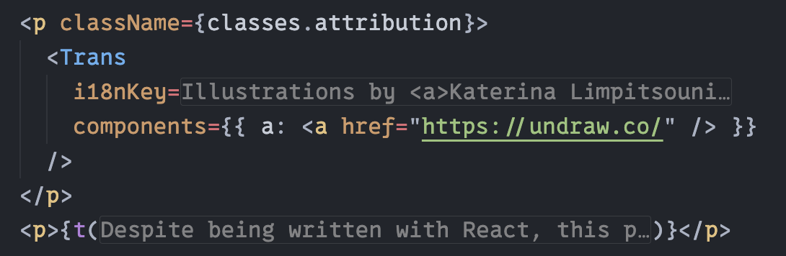
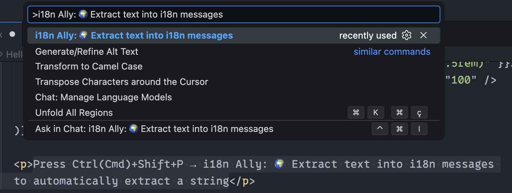
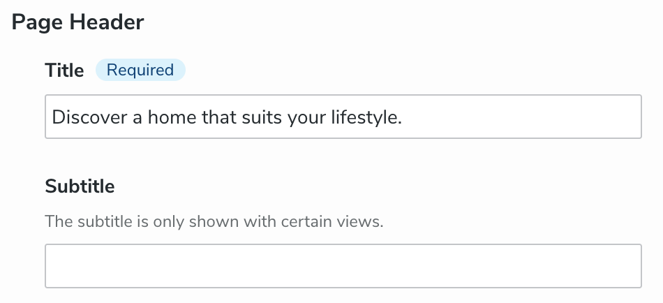
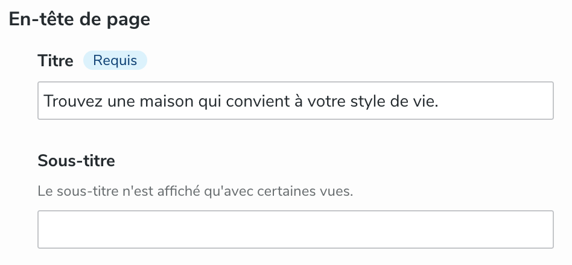
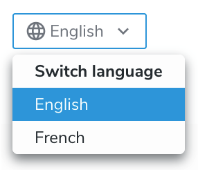
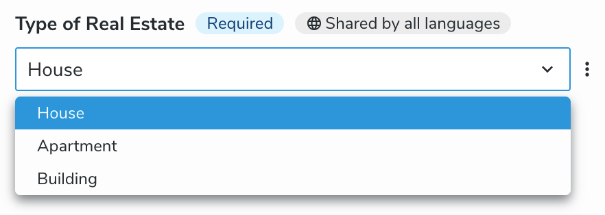

---
page:
  $path: /sites/academy/home/documentation/jahia/8_2/developer/javascript-module-development/i18n
  jcr:title: Preparing for Internationalization (i18n)
  j:templateName: documentation
content:
  $subpath: document-area/content
---

Jahia is a multilingual CMS. This guide explains how to properly prepare your module for internationalization (i18n).

## Content Definition

Even when your Jahia integration is not destined to be multilingual, it is a good practice to prepare it for i18n. The multilingual edition interface only appears when more than one language is configured on the website (⚙︎ > Sites > Choose a website > Languages), making the preparation invisible until used.

To make a field translatable, you only need to add the `i18n` attribute to the field definition, and Jahia takes care of the rest. It works for all field types and inputs.

```cnd
// Without `i18n`, the `body` field is shared across all languages
[example:contentType] > jnt:content
 - body (string, richtext)

// With `i18n`, the `body` field is translatable, each language has its own value
[example:contentType] > jnt:content
 - body (string, richtext) i18n
```

As for child nodes (e.g. `+ * (jmix:droppableContent)`), there is no such `i18n` attribute: the content tree is the same for all languages. The escape hatch for this is per-language visibility conditions (Advanced Editing > Visibility > Languages).

We recommend that you add the `i18n` attribute to:

- All visitor-facing free text fields (e.g. string, richtext, textarea)
- All weak references that point to images that may contain text or people

Under the hood, non-i18n fields will be stored on the node itself, while i18n fields will be stored as properties of `jnt:translation` child nodes named `j:translation_<language>`. You don't need to worry about this, but it is useful to know for debugging purposes.

## Views and Templates

For editor-written content, you don't have anything special to do, `i18n` properties are handled the exact same way as classic properties. Given the following Compact Node Definition (CND):

```cnd
[example:title] > jnt:content
 - title (string) i18n
 - color (string)
```

The `title` field is translatable, while the `color` field is not. As a developer, you'll retrieve them in the same way in your views and templates:

```tsx
interface Props {
  title: string; // Translatable string field
  color: string; // Non-translatable string field
}

jahiaComponent(
  {
    componentType: "view",
    nodeType: "example:title",
  },
  ({ title, color }: Props) => <h1 style={{ color }}>{title}</h1>,
  // ^ retrieve `title` and `color` the same way
);
```

### Static Text

When creating views and templates, you may want to include basic text such as `<a href="...">Read more</a>` links or `Written by {{author}}` labels. For all user-facing translations, we use the [`i18next`](https://www.i18next.com/) and [`react-i18next`](https://react.i18next.com/) libraries. For convenience, we cover the basics in this guide, but you can refer to the official documentation for more details.

Translations are stored in JSON files located in the `settings/locales` directory, named `<language>.json`. Their structure is a JSON object (potentially nested), with key-value pairs where the key is used in the code and the value is displayed to the user. For example:

```js
// en.json
{
  "key1": "Read more",
  "key2": "Written by {{author}}"
}

// fr.json
{
  "key1": "Lire la suite",
  "key2": "Écrit par {{author}}"
}
```

The translation files are loaded automatically for you. The translation code is the same for both client and server code:

```jsx
// Import the `useTranslation` hook
import { useTranslation } from "react-i18next";

function MyComponent() {
  // Get a contextualized translation function
  const { t } = useTranslation();

  return (
    <div>
      {/* Read more */}
      <a href="...">{t("key1")}</a>

      {/* Written by John Doe */}
      <p>{t("key2", { author: "John Doe" })}</p>
    </div>
  );
}
```

### IDE Integration

The `npm init @jahia/module@latest` automatically configures the [i18n ally](https://github.com/lokalise/i18n-ally#readme) extension for VS Code. When installed, it allows you to display and edit translations directly from the code, without having to open the JSON files:



It also provides a VS Code command to extract hardcoded strings into the translation files:



The `Extract text into i18n messages` command will automatically replace the selected string with a `t("...")` call.

It can also list missing or unused translations and enables collaboration features.

Check out the [i18n ally documentation](https://github.com/lokalise/i18n-ally/wiki) for a complete list of features and configuration options.

### Best Practices

#### Don't use concatenation

It could be tempting to write something like this: `t("key") + " " + author` to append dynamic data to a translation, but this will make translation impossible in languages with different word order.

For simple use cases, use [interpolation](https://www.i18next.com/translation-function/interpolation): `"key": "Written by {{author}}"` and `t("key", { author })`.

For complex use cases involving HTML tags, use the [`Trans` component](https://react.i18next.com/latest/trans-component):

<!-- prettier-ignore -->
```jsx
import { Trans } from "react-i18next";

// "key": "Written by <a>{{author}}</a>"
<Trans
  i18nKey="key"
  values={{ author: "John Doe" }}
  components={{ a: <a href="..." /> }}
/>
```

#### Use random keys

This may sound counter-intuitive, but using semantic keys like `read-more` or `written-by-author` [is an anti-pattern](https://inlang.com/blog/human-readable-message-ids). Here is a summary of the reasons invoked in the article:

- Discourage renaming keys, therefore preserving history

  When the English translation evolves (e.g. "Read more" becomes "Continue reading"), developers are tempted to rename the key from `read-more` to `continue-reading`, removing the translation history.

- Discourage copy-pasting the same translation in different contexts

  For instance, the word "close" has two meanings: "shut" (verb) and "near" (adjective). Having a `"close": "Close"` pair would make it impossible to translate this word in languages where the two meanings are different words.

- Avoid bikeshedding over key names and nesting

i18n Ally will generate a random key when using the extract command.

### Building a Language Switcher

Building a production-ready language switcher requires combining four pieces:

- [`getSiteLocales`](https://github.com/Jahia/javascript-modules/blob/main/javascript-modules-library/README.md#getsitelocales) to retrieve the list of available languages on the current site
- The `j:invalidLanguages` property to check if a translation is usable (e.g. not hidden by a visibility condition)
- `node.hasI18N(Locale locale)` to check if a node has a translation in a given language
- [`buildNodeUrl`](https://github.com/Jahia/javascript-modules/blob/main/javascript-modules-library/README.md#buildnodeurl) to construct URLs for nodes in different languages

```ts
// This example is meant for server-side rendering
import { buildNodeUrl, getSiteLocales } from "@jahia/javascript-modules-library";
import type { JCRNodeWrapper } from "org.jahia.services.content";

// `node` is the JCR node for which we want to build the language switcher
// (e.g. the current page node)
function languageSwitcher(node: JCRNodeWrapper) {
  // Retrieve all available languages on the current site
  const locales = getSiteLocales();

  // Get the list of languages for which the node is not valid
  const invalidLanguages = new Set(
    node.hasProperty("j:invalidLanguages")
      ? node
          .getProperty("j:invalidLanguages")
          .getValues()
          .map((value) => value.getString())
      : [],
  );

  const validLanguages = Object.entries(locales).filter(([code, locale]) => {
    // A language is valid if it's not in the invalidLanguages list and the node has a translation for it
    return !invalidLanguages.has(code) && node.hasI18N(locale);
  });

  for (const [code, locale] of validLanguages) {
    const url = buildNodeUrl(node, { language: code });
    // Display each language in its own language (e.g. "English", "français"...)
    console.log(`${locale.getDisplayLanguage(locale)} is available at: ${url}`);
  }
}
```

## Edition Interfaces

Jahia maintains almost all of the translations for the edition interfaces. The only thing we cannot translate for you is the display name of node types, fields, and choice list options.

To offer a multilingual edition interface, provide translations in `<module>_<language>.properties` (or `<module>.properties` in English) files in your module in the `settings/resources/` directory.

```properties
# Example for the `luxe:header` node type
# luxe-jahia-demo.properties
luxe_header=Page Header
luxe_header.title=Title
luxe_header.subtitle=Subtitle
luxe_header.subtitle.ui.tooltip=The subtitle is only shown with certain views.

# luxe-jahia-demo_fr.properties
luxe_header=En-tête de page
luxe_header.title=Titre
luxe_header.subtitle=Sous-titre
luxe_header.subtitle.ui.tooltip=Le sous-titre n'est affiché qu'avec certaines vues.
```

`field.ui.tooltip` supports basic HTML tags, such as `<strong>`. This also means you need to escape `<` and `>` as `&lt;` and `&gt;` if you want to display them as text.

 

:::info
Contrarty to what these screenshots may suggest, the edition interface language and the edited content language are independent:

- Edited content language can be changed at the top of the edition interface:

  

- Edition interface language is determined by the user's language preferences (👤 > Other information > Preferred Language).

:::

To provide translations for choice list options, use the following format:

```properties
# The field is declared as
# - type (string, choicelist[resourceBundle]) < 'house', 'apartment', 'building'
luxe_estate.type=Type of Real Estate
luxe_estate.type.house=House
luxe_estate.type.apartment=Apartment
luxe_estate.type.building=Building
```



Don't forget the `[resourceBundle]` suffix in the field declaration, otherwise the translations will be ignored.

## Reference

For further reference, you can check out the documentation of the libraries and tools we use for i18n:

- [i18next](https://www.i18next.com/)
- [react-i18next](https://react.i18next.com/)
- [i18n ally](https://github.com/lokalise/i18n-ally/wiki)

We recommend that you also consult the [i18next Best Practices](https://www.i18next.com/principles/best-practices) guide.
