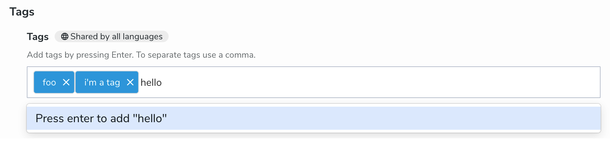

# CND file format

CND, which stands for "Compact Node Definition", is a file format used to define node types in Jackrabbit, the storage layer of Jahia. It is a simple and human-readable format that allows you to define node types and their properties, child nodes, and mixins.

The goal of this reference is document all the features of the CND format, including Jahia-specific extensions.

## Namespace declarations

This is the first part of a CND file. It defines the namespaces used in the file. The syntax is as follows:

```cnd
<name = uri>
```

For instance, Jahia's namespaces are defined as follows:

```cnd
// Jahia namespace for properties:
<j = 'http://www.jahia.org/jahia/1.0'>
// Jahia namespace for node types:
<jnt = 'http://www.jahia.org/jahia/nt/1.0'>
// Jahia namespace for mixins:
<jmix = 'http://www.jahia.org/jahia/mix/1.0'>
```

Because there is no way to differentiate between node types and mixins in the CND format, Jahia uses two different namespaces to define them. We recommend you do the same in your projects.

## Node types

A node type is a definition of a type of node in the repository. It can be instantiated to create nodes in the repository.

A node type definition is composed of the following elements:

- A name, enclosed in square brackets and prefixed by a namespace.
- A parent node type, if any.
- A list of parent mixins, if any.
- A list of properties.
- A list of child nodes.

It looks like this:

```cnd
[ns:nodeType] > ns:baseType, nsmix:mixin1, nsmix:mixin2
 - property1 (type) = default
 - property2 (type) = default
 + childNode1 (type)
 + childNode2 (type)
```

Nodes may be abstract, preventing them from being instantiated. This is done by adding the `abstract` keyword.

## Mixins

A mixin is a reusable set of properties and child nodes that can be added to a node type. It is defined in the same way as a node type, apart from the `mixin` keyword. It does not have a parent node type, but it can have parent mixins.

```cnd
[nsmix:mixin] > nsmix:baseMixin1, nsmix:baseMixin2
 - property1 (type) = default
 - property2 (type) = default
 + childNode1 (type)
 + childNode2 (type)
```

Mixins have different use cases, such as:

- Grouping common properties to avoid duplication.
- Add behaviors to nodes or mixins (e.g. `jmix:droppableContent` makes a content node available in Page Builder).
- Extend the functionality of a node type outside of its definition.

This last point resorts to a rare keyword in CND: `extends`. For the exhaustivity of this reference, we will document it here, but we recommend you avoid using it in your projects:

```cnd
[jmix:keywords] mixin
 extends = nt:hierarchyNode, jnt:content, jnt:page
 - j:keywords (string) multiple
```

## Properties

A property is defined by:

- A name, after the `-` character.
- A type, enclosed in parentheses.
- An optional visual editor hint, after the type, enclosed in parentheses.
- A list of modifiers, as a list of keywords.
- An optional default value, after the `=` character.
- An optional list of constraints, after the `<` character.

Here is a complete example:

```cnd
[ns:example] > jnt:content
 - color (string, color) = '#000000' mandatory autocreated nofulltext
 - dateWithBounds (date, DatePicker) < "(2019-06-04T00:00:00.000,2021-06-20T00:00:00.000)"
 - choicelist (string, choicelist[resourceBundle]) = 'choice1' i18n < 'choice1', 'choice2', 'choice3'
 - page (weakreference, picker[type='page'])
 - categories (weakreference, choicelist[nodes='/sites/systemsite/categories;jnt:category',sort]) multiple
 - nodeNames (name) = 'ns:node' multiple
```

## Property types

Jahia supports 13 property types, each with its own set of specificities. The exhaustive list is as follows, and they are listed in the order of their integer constants in the Jackrabbit API.

### `undefined` (0)

This type represents an unknown type. It may contain any value. It is not recommended to use it in your projects.

### `string` (1)

This type represents a string, that is, a sequence of characters. It is one of the most powerful types in Jahia, and sports a lot of features.

Constraints applied to a string property are interpreted as regular expressions, with automatic anchors added to the beginning and end of the expression if they are not already present.

For instance `< 'winter', 'spring', 'summer', 'fall'` will match any of the four seasons. It is equivalent to `< '^winter$', '^spring$', '^summer$', '^fall$'`, as well as `< '^winter$|^spring$|^summer$|^fall$'`. It is NOT equivalent to `< 'winter|spring|summer|fall'`: Jahia will interpret this as `< '^winter|spring|summer|fall$'`, which will match any string starting with `winter`, containing `spring` or `summer`, or ending with `fall`.

It is recommended to use a list of strings as it is more readable and less error-prone, and behaves nicely in the UI. Otherwise, use a single regular expression, wrapped in `^(` and `)$`, to circumvent the automatic anchors and their potential issues.

Speaking of the UI, let's list all possible visual editor hints for string properties. When no hint is provided, the UI will display a simple text input.

#### `choicelist`

This hint will display a dropdown list in the UI. The list of choices is defined in the constraints, as a list of strings.

#### `choicelist[componentTypes='<types>']`

The dropdown list will be populated with a list of coma-separated component types or mixins.

You may prefix `<types>` with `notRestrictedToDependencies;`, to allow selecting components that are not dependencies of the current component.

#### `choicelist[country]`

The dropdown list will be populated with a list of countries.

#### `choicelist[menus]`

The dropdown list will be populated with a list of menus.

#### `choicelist[nodes='<path>;<type>;<property>']`

The dropdown list will be populated with a list of nodes from a specific path, of a specific type, and displaying a specific property.

This string can contain the following variables:

- `$currentSiteTemplatesSet`: the list of site templates available in the current site.

#### `choicelist[nodetypes='<type>']`

The dropdown list will be populated with a list of node types inheriting from `<type>`.

`<type>` can also be these special values:

- `PRIMARY;fromDependencies;useName`: the list of primary node types from dependencies, using the node type name.
- `MIXIN;fromDependencies;useName`: the list of mixins from dependencies, using the node type name.

#### `choicelist[permissions]`

The dropdown list will be populated with a list of permissions.

#### `choicelist[renderModes]`

The dropdown list will be populated with a list of render modes.

#### `choicelist[resourceBundle]`

The dropdown list will display a list of values from a resource bundle, while the keys are listed as constraints.

Example:

```cnd
[ns:helloCard] > ns:component, jnt:content
 - illustration (string, choicelist[resourceBundle]) mandatory < code, coffee, interface, read, write
```

Resource bundle:

```ini
ns_helloCard=Hello Card
ns_helloCard.illustration=Illustration
ns_helloCard.illustration.code=A developer coding
ns_helloCard.illustration.coffee=Buying coffee
ns_helloCard.illustration.interface=Consulting an interface
ns_helloCard.illustration.read=Looking at a bookshelf
ns_helloCard.illustration.write=Writing with a typewriter
```

`resourceBundle` might be combined with other choicelist hints.

#### `choicelist[sortableFieldnames]`

The dropdown list will be populated with a list of sortable field names, probably.

#### `choicelist[subnodetypes='<type>']`

The dropdown list will be populated with a list of node types inheriting from `<type>`. It may or may not behave like `choicelist[nodetypes='<type>']`.

#### `choicelist[templates]`

The dropdown list will be populated with a list of site templates.

It has a few variations:

- `choicelist[templates=mainresource]`, to filter the list of templates to those applying to main resources.
- `choicelist[templates=reference]`, to filter the list of templates to those applying to some reference node.strin
- `choicelist[templates=subnodes]`, to filter the list of templates to those applying to subnodes of the current node.
- `choicelist[templates=<type>]`, to filter the list of templates to those applying to nodes of type `<type>`.

You can add `, dependentProperties='<property>'` next to the previous hint to restrict the list of templates to those that have a specific property set.

#### `choicelist[templatesNode]`

The dropdown list will be populated with a list of node templates.

Similar to `choicelist[templates]`, it allows you to filter the list of templates to those applying to nodes of a specific type:

- `choicelist[templatesNode=pageTemplate]`: filter the list of templates to those applying to page nodes.

#### `choicelist[workflow]`

The dropdown list will be populated with a list of available workflows.

#### `color`

This hint will display a color picker in the UI.

#### `cron`

This hint will display a cron expression editor in the UI.

#### `richtext`

This hint will display a rich (HTML) text editor in the UI. The resulting value will be stored as a string, but might contain HTML tags (e.g. `<p>`, `<strong>`, `<a>`).

#### `tag[...]`

This hint will display a tag input in the UI:



The `...` is an optional list of coma-separated settings:

- `autocomplete=<number>`: number of suggestions to display in the autocomplete dropdown.
- `separator='<char>'`: character used to separate tags in the input field, and allow creating several tags at once.

`tag` should be combined with the `multiple` modifier, as it will store the tags as a list of strings.

#### `textarea`

This hint will display a multi-line text input in the UI.

### `binary` (2)

This type represents a blob of binary data. It is used to store files, images, and other binary data.

Constraints on `binary` properties are interpreted as a range of valid file sizes, in bytes. The syntax is the same as `long` right below.

### `long` (3)

A long is a 64-bit integer.

Constraints on `long` properties are interpreted as a range of valid values. The syntax is as follows:

- `< '[min,max]'`: the value must be between `min` and `max`, inclusive.
- `< '(min,max)'`: the value must be between `min` and `max`, exclusive.
- `< '[min,)'`: the value must be greater than or equal to `min`.
- `< '(min,)'`: the value must be greater than `min`.
- `< '(,max]'`: the value must be less than or equal to `max`.
- `< '(,max)'`: the value must be less than `max`.

You may use a choicelist instead of a range, to restrict the possible values to a list of integers: `- podium (long, choicelist) < '1', '2', '3'`.

### `double` (4)

A double is a 64-bit floating-point number. It is used to store decimal numbers. The constraints work the same way as for `long`.

### `date` (5)

A date is a point in time, with a precision of milliseconds. It is used to store dates and times. It does not store a specific timezone, all values are stored in UTC.

Constraintes on `date` properties are interpreted as a range of valid dates. The syntax is as follows:

- `< '[min,max]'`: the value must be between `min` and `max`, inclusive.
- `< '(min,max)'`: the value must be between `min` and `max`, exclusive.
- `< '[min,)'`: the value must be greater than or equal to `min`.
- `< '(min,)'`: the value must be greater than `min`.
- `< '(,max]'`: the value must be less than or equal to `max`.
- `< '(,max)'`: the value must be less than `max`.

You may use a choicelist instead of a range, to restrict the possible values to a list of dates: `- date (date, choicelist) < '2021-06-04T00:00:00.000', '2021-06-20T00:00:00.000'`.

There are two specific visual editor hints for date properties: `datepicker` and `datetimepicker`. They will display a date picker or a date and time picker in the UI, respectively.

There is a specific default value function `= now()` that will set the property to the current date and time.

### `boolean` (6)

This type represents a boolean value, that is, a value that can be either `true` or `false`. It is displayed as a checkbox in the UI. Because of the way Jahia is built, the value might not be stored unless it's `true`. Consider any non-`true` value as `false`.

### `name` (7)

`name` is used to store the name of JCR node types or properties. It behaves like a string, visual hints and all. There is use outside of Jahia core, it is recommended to use `string` instead.

### `path` (8)

`path` is used to store the path of a JCR node, as string. Please use `weakreference` to store references to nodes.

### `reference` (9)

While defined in the JCR specification, `reference` is not implemented in Jahia, and is instead interpreted as `weakreference`. Don't use the `reference` type in your projects, as it may be implemented differently in the future.

### `weakreference` (10)

This is the preferred way to store references to JCR nodes.

Constraints on `weakreference` properties are interpreted as a list of possible node types. The syntax is as follows:

- `< 'ns:nodeType1', 'nodeType2'`: the value must be a node of type `ns:nodeType1` or `ns:nodeType2`.

Please note that the constraint is the only thing that will be enforced. You can specify many visual picker hints, but the only way to ensure that what is stored is of the right type is to use constraints.

Here are all possible visual editor hints for `weakreference` properties:

#### `picker[type='image']`

Prompts the user to select an image from the media library, or upload a new one.

#### `picker[type='editoriallink']`

Prompts the user to select an editorial content node.

### `uri` (11)

`uri` is used to store URIs, that is, strings that represent a resource on the web. `string` is more versatile and should be used instead.

### `decimal` (12)

Used to represent decimal numbers. It is recommended to use `double` instead.

## Keywords

### `abort`

### `autocreated`

This keyword will create the property automatically when the node is created, set to the default value, which must be provided.

### `boost=<float>`

This keyword will multiply the score of the property by the provided float when indexing the node. It is used to boost the relevance of a property in full-text searches.

### `compute`

### `copy`

### `hidden`

### `i18n`

This keyword will make the property internationalized, that is, it will store a different value for each language. The value will be stored on properties of `j:translation_<lang>` children of the node.

### `ignore`

### `facetable`

### `hierarchical`

### `indexed=no`

### `initialize`

### `itemtype=<codeEditor|content|metadata>`

### `mandatory`

This will make the property mandatory, that is, it must have a value when the node is created. Because of the way Jahia is built, this may have unexpected consequences. In the case of `multiple mandatory` properties, there is no visual difference between an empty list and an undefined property in the editor.

### `multiple`

This keyword will allow the property to store a list of values instead of a single one. It is not possible to mix types in a list, all values must be of the same type.

A default value can be set with the `=` character, followed by a coma-separated list of values, e.g. `= 'value1', 'value2', 'value3'`. Because the syntax does not support it, the default value cannot be an empty list.

### `nofulltext`

### `onconflict=ignore`

### `primary`

This keyword can only be used once in a node type definition. It will make the property the primary property of the node type, that is, the one displayed when the node is rendered in text form.

### `protected`

## Child nodes
