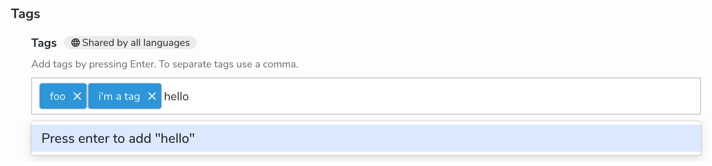

# CND file format

CND, which stands for "Compact Node Definition", is a file format used to define node types in Jackrabbit, the storage layer of Jahia. It is a simple and human-readable format that allows you to define node types and their properties, child nodes, and mixins.

The goal of this reference is document all the features of the CND format, including Jahia-specific extensions.

## Namespace declarations

This is the first part of a CND file. It defines the namespaces used in the file. The syntax is as follows:

```cnd
<name = uri>
```

For instance, Jahia's namespaces are defined as follows:

```cnd
// Jahia namespace for properties:
<j = 'http://www.jahia.org/jahia/1.0'>
// Jahia namespace for node types:
<jnt = 'http://www.jahia.org/jahia/nt/1.0'>
// Jahia namespace for mixins:
<jmix = 'http://www.jahia.org/jahia/mix/1.0'>
```

Because there is no way to differentiate between node types and mixins in the CND format, Jahia uses two different namespaces to define them. We recommend you do the same in your projects.

## Node types

A node type is a definition of a type of node in the repository. It can be instantiated to create nodes in the repository.

A node type definition is composed of the following elements:

- A name, enclosed in square brackets and prefixed by a namespace.
- A parent node type, if any.
- A list of parent mixins, if any.
- A list of properties.
- A list of child nodes.

It looks like this:

```cnd
[ns:nodeType] > ns:baseType, nsmix:mixin1, nsmix:mixin2
 - property1 (type) = default
 - property2 (type) = default
 + childNode1 (type)
 + childNode2 (type)
```

Nodes may be abstract, preventing them from being instantiated. This is done by adding the `abstract` keyword.

## Mixins

A mixin is a reusable set of properties and child nodes that can be added to a node type. It is defined in the same way as a node type, apart from the `mixin` keyword. It does not have a parent node type, but it can have parent mixins.

```cnd
[nsmix:mixin] > nsmix:baseMixin1, nsmix:baseMixin2
 - property1 (type) = default
 - property2 (type) = default
 + childNode1 (type)
 + childNode2 (type)
```

Mixins have different use cases, such as:

- Grouping common properties to avoid duplication.
- Add behaviors to nodes or mixins (e.g. `jmix:droppableContent` makes a content node available in Page Builder).
- Extend the functionality of a node type outside of its definition.

This last point resorts to a rare keyword in CND: `extends`. For the exhaustivity of this reference, we will document it here, but we recommend you avoid using it in your projects:

```cnd
[jmix:keywords] mixin
 extends = nt:hierarchyNode, jnt:content, jnt:page
 - j:keywords (string) multiple
```

## Properties

A property is defined by:

- A name, after the `-` character.
- A type, enclosed in parentheses.
- An optional visual editor hint, after the type, enclosed in parentheses.
- A list of modifiers, as a list of keywords.
- An optional default value, after the `=` character.
- An optional list of constraints, after the `<` character.

Here is a complete example:

```cnd
[ns:example] > jnt:content
 - color (string, color) = '#000000' mandatory autocreated nofulltext
 - dateWithBounds (date, DatePicker) < "(2019-06-04T00:00:00.000,2021-06-20T00:00:00.000)"
 - choicelist (string, choicelist[resourceBundle]) = 'choice1' i18n < 'choice1', 'choice2', 'choice3'
 - page (weakreference, picker[type='page'])
 - categories (weakreference, choicelist[nodes='/sites/systemsite/categories;jnt:category',sort]) multiple
 - nodeNames (name) = 'ns:node' multiple
```

## Property types

Jahia supports 13 property types, each with its own set of specificities. The exhaustive list is as follows, and they are listed in the order of their integer constants in the Jackrabbit API.

### `undefined` (0)

This type represents an unknown type. It may contain any value. It is not recommended to use it in your projects.

### `string` (1)

This type represents a string, that is, a sequence of characters. It is one of the most powerful types in Jahia, and sports a lot of features.

Constraints applied to a string property are interpreted as regular expressions, with automatic anchors added to the beginning and end of the expression if they are not already present.

For instance `< 'winter', 'spring', 'summer', 'fall'` will match any of the four seasons. It is equivalent to `< '^winter$', '^spring$', '^summer$', '^fall$'`, as well as `< '^winter$|^spring$|^summer$|^fall$'`. It is NOT equivalent to `< 'winter|spring|summer|fall'`: Jahia will interpret this as `< '^winter|spring|summer|fall$'`, which will match any string starting with `winter`, containing `spring` or `summer`, or ending with `fall`.

It is recommended to use a list of strings as it is more readable and less error-prone, and behaves nicely in the UI. Otherwise, use a single regular expression, wrapped in `^(` and `)$`, to circumvent the automatic anchors and their potential issues.

Speaking of the UI, let's list all possible visual editor hints for string properties. When no hint is provided, the UI will display a simple text input.

#### `choicelist`

This hint will display a dropdown list in the UI. The list of choices is defined in the constraints, as a list of strings.

#### `choicelist[componentTypes='<types>']`

The dropdown list will be populated with a list of coma-separated component types or mixins.

You may prefix `<types>` with `notRestrictedToDependencies;`, to allow selecting components that are not dependencies of the current component.

#### `choicelist[country]`

The dropdown list will be populated with a list of countries.

#### `choicelist[menus]`

The dropdown list will be populated with a list of menus.

#### `choicelist[nodes='<path>;<type>;<property>']`

The dropdown list will be populated with a list of nodes from a specific path, of a specific type, and displaying a specific property.

This string can contain the following variables:

- `$currentSiteTemplatesSet`: the list of site templates available in the current site.

#### `choicelist[nodetypes='<type>']`

The dropdown list will be populated with a list of node types inheriting from `<type>`.

`<type>` can also be these special values:

- `PRIMARY;fromDependencies;useName`: the list of primary node types from dependencies, using the node type name.
- `MIXIN;fromDependencies;useName`: the list of mixins from dependencies, using the node type name.

#### `choicelist[permissions]`

The dropdown list will be populated with a list of permissions.

#### `choicelist[renderModes]`

The dropdown list will be populated with a list of render modes.

#### `choicelist[resourceBundle]`

The dropdown list will display a list of values from a resource bundle, while the keys are listed as constraints.

Example:

```cnd
[ns:helloCard] > ns:component, jnt:content
 - illustration (string, choicelist[resourceBundle]) mandatory < code, coffee, interface, read, write
```

Resource bundle:

```ini
ns_helloCard=Hello Card
ns_helloCard.illustration=Illustration
ns_helloCard.illustration.code=A developer coding
ns_helloCard.illustration.coffee=Buying coffee
ns_helloCard.illustration.interface=Consulting an interface
ns_helloCard.illustration.read=Looking at a bookshelf
ns_helloCard.illustration.write=Writing with a typewriter
```

`resourceBundle` might be combined with other choicelist hints.

#### `choicelist[sortableFieldnames]`

The dropdown list will be populated with a list of sortable field names, probably.

#### `choicelist[subnodetypes='<type>']`

The dropdown list will be populated with a list of node types inheriting from `<type>`. It may or may not behave like `choicelist[nodetypes='<type>']`.

#### `choicelist[templates]`

The dropdown list will be populated with a list of site templates.

It has a few variations:

- `choicelist[templates=mainresource]`, to filter the list of templates to those applying to main resources.
- `choicelist[templates=reference]`, to filter the list of templates to those applying to some reference node.strin
- `choicelist[templates=subnodes]`, to filter the list of templates to those applying to subnodes of the current node.
- `choicelist[templates=<type>]`, to filter the list of templates to those applying to nodes of type `<type>`.

You can add `, dependentProperties='<property>'` next to the previous hint to restrict the list of templates to those that have a specific property set.

#### `choicelist[templatesNode]`

The dropdown list will be populated with a list of node templates.

Similar to `choicelist[templates]`, it allows you to filter the list of templates to those applying to nodes of a specific type:

- `choicelist[templatesNode=pageTemplate]`: filter the list of templates to those applying to page nodes.

#### `choicelist[workflow]`

The dropdown list will be populated with a list of available workflows.

#### `color`

This hint will display a color picker in the UI.

#### `richtext`

This hint will display a rich (HTML) text editor in the UI. The resulting value will be stored as a string, but might contain HTML tags (e.g. `<p>`, `<strong>`, `<a>`).

#### `tag[...]`

This hint will display a tag input in the UI:



The `...` is an optional list of coma-separated settings:

- `autocomplete=<number>`: number of suggestions to display in the autocomplete dropdown.
- `separator='<char>'`: character used to separate tags in the input field, and allow creating several tags at once.

`tag` should be combined with the `multiple` modifier, as it will store the tags as a list of strings.

#### `textarea`

This hint will display a multi-line text input in the UI.

### `binary` (2)

### `long` (3)

### `double` (4)

### `date` (5)

### `boolean` (6)

### `name` (7)

### `path` (8)

### `reference` (9)

### `weakreference` (10)

### `uri` (11)

### `decimal` (12)

## Keywords

### `abort`

### `autocreated`

### `boost=<float>`

### `compute`

### `copy`

### `hidden`

### `i18n`

### `ignore`

### `facetable`

### `hierarchical`

### `indexed=no`

### `initialize`

### `itemtype=<codeEditor|content|metadata>`

### `mandatory`

### `multiple`

### `nofulltext`

### `onconflict=ignore`

### `primary`

### `protected`

## Child nodes
